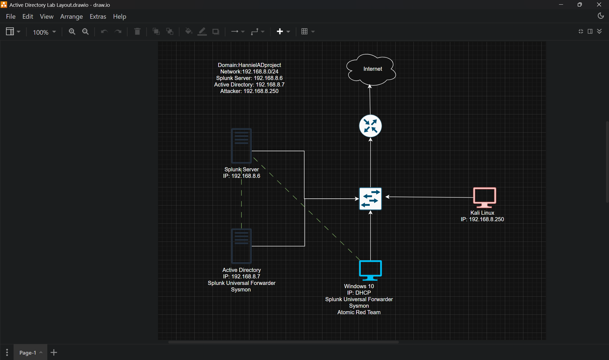

# 🛡️ Active Directory Home Lab
--------------------------------------
## 📌 Overview

This project is a hands-on **Active Directory (AD) Home Lab** designed to simulate a small enterprise network for cybersecurity training, monitoring, and attack simulation. The lab combines Windows infrastructure, centralized logging, and offensive security tools to provide practical experience with both **Blue Team** and **Red Team** operations.

The environment is built on the `192.168.8.0/24` network and includes:

- Windows Active Directory Domain Controller
- Splunk SIEM Server
- Windows 10 Endpoint
- Kali Linux Attacker Machine

To improve visibility and monitoring, **Sysmon** and **Splunk Universal Forwarders** are deployed on Windows systems to collect and forward endpoint telemetry to the Splunk server for centralized analysis.

---

## 🎯 Objectives

- Build and manage a functional Active Directory environment
- Configure centralized logging with Splunk
- Deploy Sysmon for advanced endpoint monitoring
- Simulate attacks using Kali Linux and Atomic Red Team
- Practice threat detection and incident analysis
- Gain practical SOC and cybersecurity experience

---
## 🖥️ Lab Architecture

| Component | IP Address | Purpose |
|-----------|------------|---------|
| Splunk Server | `192.168.8.6` | Centralized SIEM and log analysis |
| Active Directory Server | `192.168.8.7` | Domain Controller and authentication services |
| Windows 10 Client |`DHCP` | Endpoint monitoring and testing |
| Kali Linux | `192.168.8.250` | Attack simulation and penetration testing |

---
## 🔧 Technologies Used

- **Windows Server 22**
- **Ubuntu Server**
- **Active Directory**
- **Splunk Enterprise**
- **Sysmon**
- **Splunk Universal Forwarder**
- **Kali Linux**
- **Atomic Red Team**
- **Oracle VirtualBox**

---
## 📷 Lab Diagram

---
